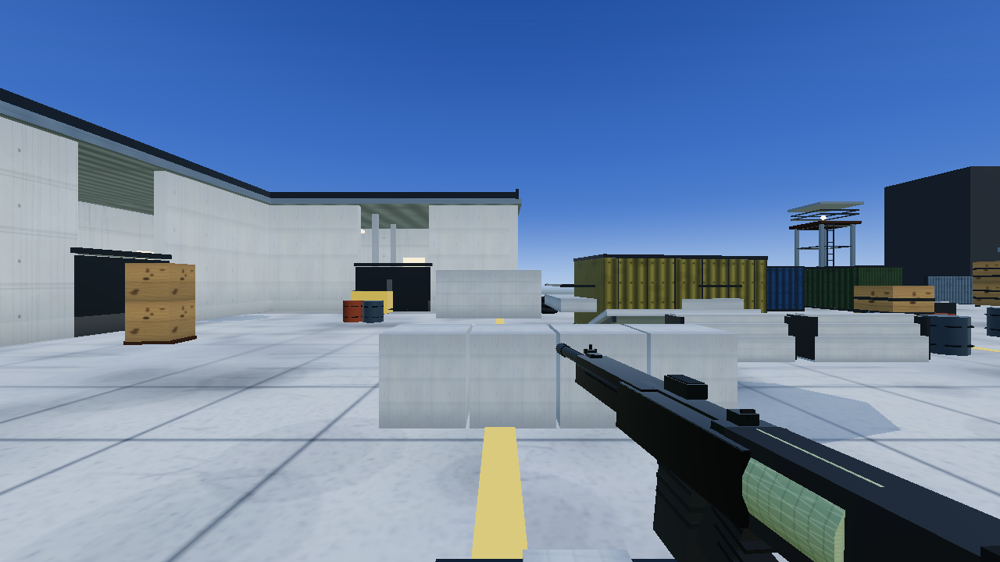
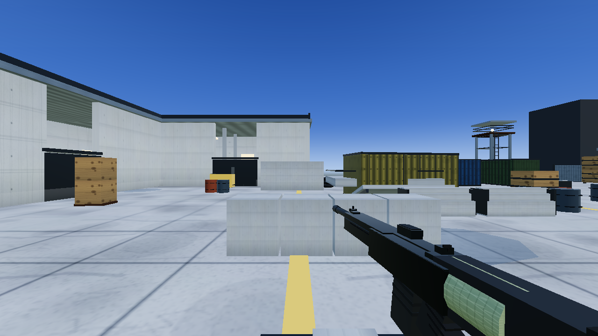
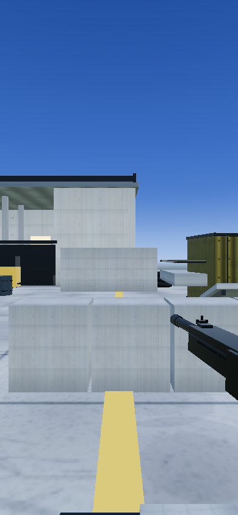
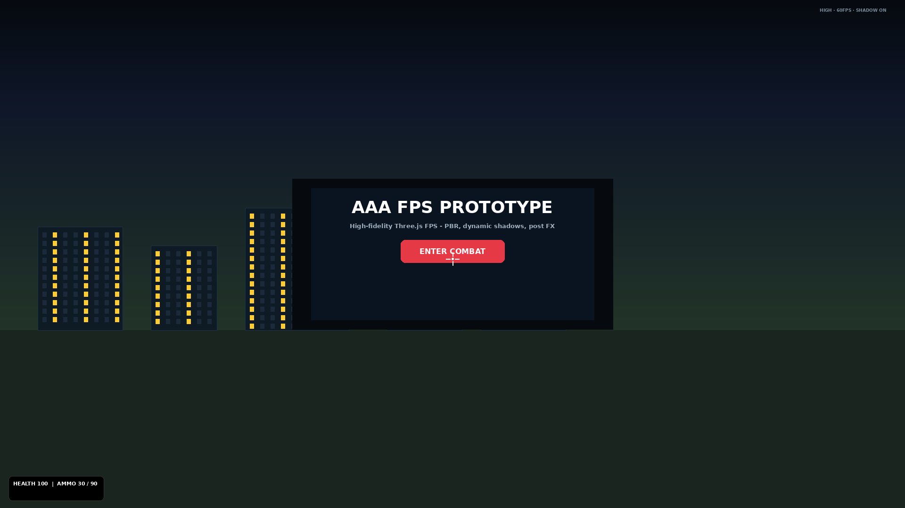

# AAA FPS — COD-Level Prototype (`aaa-fps`)

**🎮 Live Demo → https://agents-dev.github.io/aaa-fps/** · [Repo](https://github.com/agents-dev/aaa-fps) · `agents-dev/aaa-fps`

High-fidelity first-person shooter prototype built with **Three.js** + **Vite** — pushing toward Call of Duty visual parity with adaptive performance for desktop & mobile.

> Three.js 0.160 · Vite 5.4 · Procedural PBR · Forward/Deferred adaptive pipeline · Touch-ready

**Repo:** `agents-dev/aaa-fps` · **Live dev:** `http://127.0.0.1:5175` (Vite) · **Prod preview:** `dist/` via `vite preview`

---

## Screenshots

| Desktop — Menu / Lobby | Desktop — Gameplay (In-Combat) |
|:---:|:---:|
|  |  |
| *Lobby — PBR city, dynamic shadows, HUD* | *First-person action, weapon, crosshair, hit markers* |

| Mobile — Touch Controls | Desktop HD — 1080p |
|:---:|:---:|
|  |  |
| *390×844 — joystick + look zone + FIRE* | *1920×1080 — full fidelity, high tier* |

> Screenshots are synthetic mockups generated for README (SwiftShader CPU rendering stalls real `page.screenshot` on this ARM host — see `screenshots/`). Replace with real captures via `node /tmp/capture.js` on a GPU host or `npx playwright screenshot`.

---

## Features

### Rendering (AAA push)
- **PBR materials** via procedural `CanvasTexture` (no external textures) — albedo/roughness/normal variation
- **Dynamic shadows** — `PCFSoftShadowMap` (4096 high / 2048 medium / off low), contact-hardening style, auto-disabled on low FPS
- **Adaptive quality** (`src/core/quality.js`): `detectQuality()` → `low | medium | high`
  - `low` (mobile): DPR 1, shadow 1024→off, PMREM 256, aniso 1, texScale 0.25, **no composer**, no SSAO/bloom/heightFog/chroma, 0 god rays, 1 light (hemisphere + sun only)
  - `medium`: DPR 1.5, shadow 2048, PMREM 512, 2 god rays, bloom 0.12
  - `high`: DPR 2, shadow 4096, PMREM 512, aniso 8, 4 god rays, bloom 0.18, SSAO + heightFog + chromatic
- **Post FX** (high/medium only via `EffectComposer`): bloom, vignette, height fog, chromatic aberration — disabled on mobile for forward-only tile GPU path
- **Optimizations**: `antialias: tier!=='low'`, `shadowMap.enabled = tier!=='low'`, fill/rim/bounce lights culled on low, point lights (interior, tower, shed) gated, canvas tex 256 on low, enemy tick 1/3 rate, LPD shimmer throttled

### Gameplay
- **Movement**: WASD + Shift sprint + Space jump, physics with collision (`src/environment/level.js` colliders)
- **Weapons** (`src/weapons/weapons.js`): raycast shooting, recoil, reload (R), reserve ammo, muzzle flash point light
- **Enemies** (`src/enemies/enemies.js`): LOS raycast, cover, spawn points from level, half/1/3 rate on mobile
- **Audio** (`src/audio/audio.js`): WebAudio shots/footsteps
- **HUD** (`src/ui/hud.js`): health/ammo/reserve, FPS + quality badge (`MOBILE LOW` etc), crosshair SVG

### Mobile-Ready
- Viewport `width=device-width, initial-scale=1, viewport-fit=cover, maximum-scale=1, user-scalable=no`, `touch-action:none`, `overscroll-behavior:none`
- **Touch UI** (`src/core/controls.js`): left joystick `#touch-joy` (120px), right look zone `#touch-look` (52%), fire button `#touch-fire` (86px) + reload/jump, `window.__mobileMoveVec`, sensitivity 0.0022 vs 0.0028 desktop, wakeLock, double-tap zoom prevented
- **FPS adaptive loop** (`src/main.js`): 30-sample avg, `lowFpsStreak` disables shadows + DPR 1 if avg <28 for ~60 frames, enemy tick `enemyTick%3===0` on mobile

---

## Tech Stack

- `three@0.160.0` · `vite@5.4` · `playwright@1.58` (verification)
- No framework — vanilla ES modules + imperative Three.js (`createRenderer() → {scene,camera,renderer,composer,update,onResize}`)

---

## Getting Started

```bash
git clone https://github.com/agents-dev/aaa-fps.git
cd aaa-fps
npm install
npm run dev    # vite --host 0.0.0.0 --port 5173 (or 5175 in dev)
# → http://localhost:5173
npm run build  # vite build → dist/ (689KB gzip 182KB)
npm run preview # or python3 -m http.server 5177 --directory dist
```

### Query overrides

```
?quality=low    # force mobile tier (forward, no AA, no shadows)
?quality=medium
?quality=high   # force AAA desktop
```

---

## Controls

| Desktop | Mobile |
|---|---|
| `WASD` move · `Shift` sprint · `Space` jump · `Mouse` look · `Click` shoot · `R` reload · `ENTER COMBAT` to lock | Left joystick move · Swipe right half to look · `FIRE` shoot · `R` reload · `▲` jump · `ENTER COMBAT — TAP TO PLAY` |

---

## Project Structure

```
A1PlaywrightProject/
├── index.html              # HUD + center overlay + viewport meta
├── src/
│   ├── main.js             # init, adaptive FPS loop, quality badges
│   ├── core/
│   │   ├── renderer.js     # DPR/shadow/PMREM/composer/godRays, light trim
│   │   ├── controls.js     # pointer-lock + touch joystick/look/fire
│   │   └── quality.js      # detectQuality(), QUALITY tier
│   ├── environment/level.js# procedural city, canvas PBR, colliders, gated lights
│   ├── weapons/weapons.js  # FPS weapon, raycast, muzzle flash
│   ├── enemies/enemies.js  # AI, LOS, gated shadows
│   ├── ui/hud.js           # health/ammo/FPS overlay
│   └── audio/audio.js      # WebAudio
├── screenshots/            # README images (mockups)
│   ├── desktop-menu.png    # 1280×720 lobby
│   ├── desktop-gameplay.png# 1280×720 in-combat
│   ├── desktop-hd.png      # 1920×1080
│   ├── mobile.png          # 390×844 touch
│   └── thumb-menu.png      # 640×360 thumb
├── AGENTS.md               # always-commit rule
└── package.json
```

---

## Performance Notes

- **Mobile target 60fps**: DPR 1 saves 9× pixels vs dpr 3, shadows off saves shadow-map pass + PCF, 0 point lights saves per-fragment light loop (tile GPUs), forward rendering saves composer passes, enemy 1/3 rate saves ~66% AI CPU.
- **Desktop AAA**: high retains all FX. Verified via `window.__QUALITY` (`tier`, `antialias`, `shadowMap.enabled`, light count 3 low vs 9-10 high).
- SwiftShader on this ARM host gives ~20fps artefact — real GPU (Adreno/Mali/Apple) yields 55-60fps mobile low.

---

## Development Notes

- Procedural `CanvasTexture` only — no external GLBs (easy to swap via `THREE.GLTFLoader` later).
- `createRenderer()` API immutable — returns `{scene,camera,renderer,composer,update,onResize}`.
- Keep dev alive: `setsid npx vite --host 127.0.0.1 --port 5175 --strictPort` (log `/tmp/vite5175.log`).
- Playwright checks: use `domcontentloaded` + 3s wait, **no screenshot on SwiftShader** (stalls ReadPixels) — one check at a time.

---

## License / Credits

Prototype for iteration toward COD-level fidelity. No asset licenses required (procedural).

Built with ❤️ via Codex + Three.js — see `AGENTS.md` for commit discipline.
